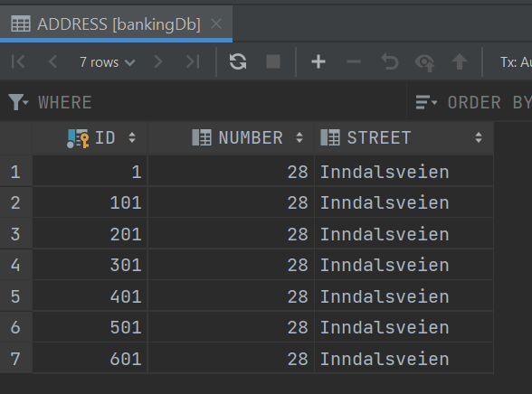

# Expass 2

### Technical problems
I had some difficulties with install derby, it did not 
work in the Git bash console or in powershell. But it 
worked when I used command prompt.

### Link to my code
https://github.com/mhhundvin/dat250-jpa-examples

### Inspection of the database tables
In this picture you can see that I successfully manged to
update the TODO table in the database.

This pictures shows that the test for the eclipselink
projects passed, and I edited the test to add a family relation.

For the final part of the exercise I created the classes
Address, Person, Bank, Pincode and CreditCard, with
relations I found suitable. All the relations are one to
many (many to one) except for the relation between CreditCard
and Pincode which is one to one. I see that in det model this
relation is one to many, but I think it makes more sens with
one to one.

### Pending issues