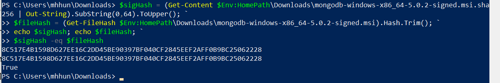
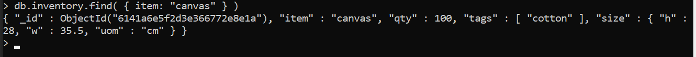
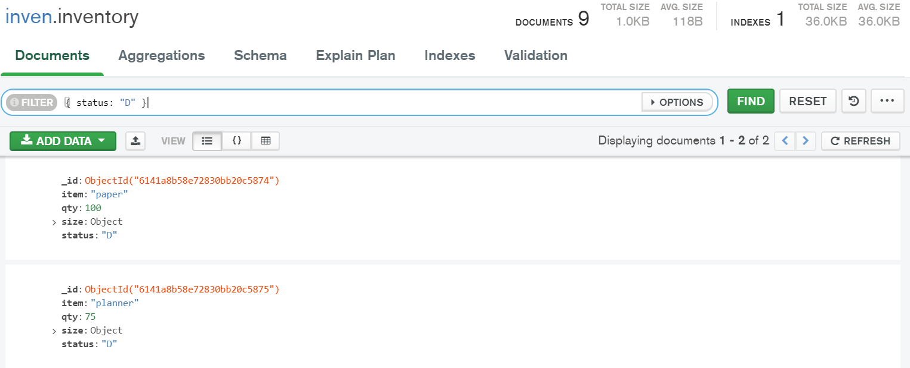
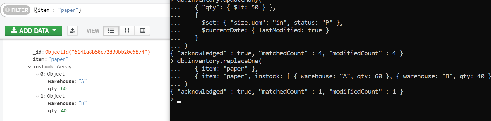
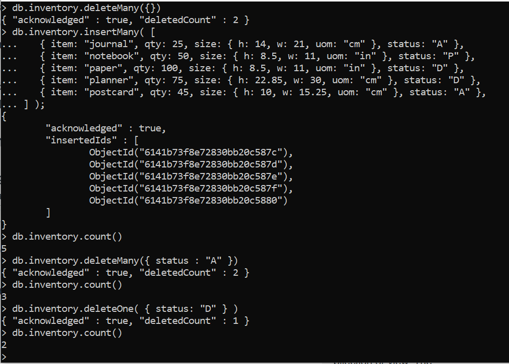
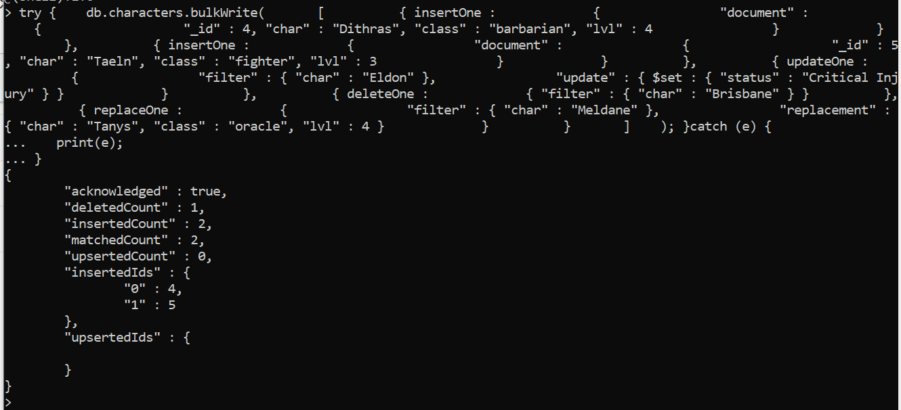
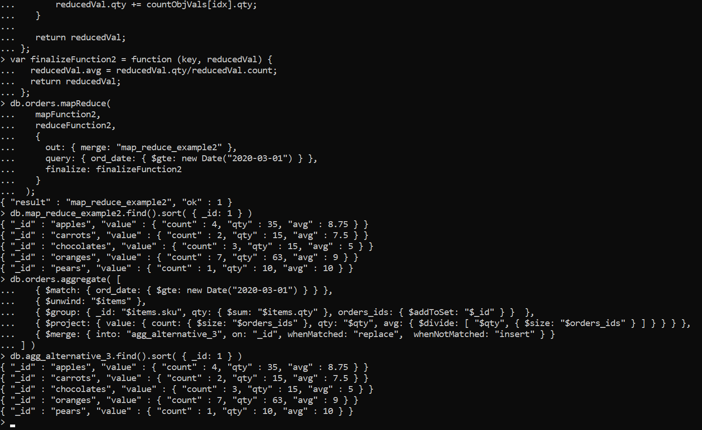
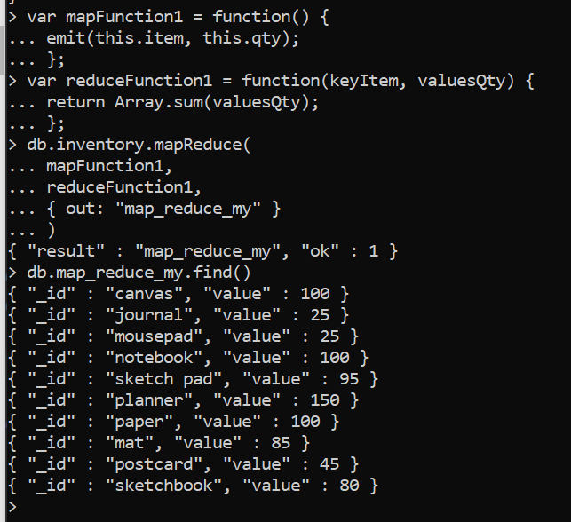

# Expass 3

### Technical problems
I had no technical problems with the installing and 
use of MongoDB. I did however download version 5.0.2
and not 4.4. But the map-reduce operations still works.

### ScreenShots
Validation:

Experiment 1:    
*Successfully inserted into collection inventory*

*Query*

*Update*

*Remove*

*Bulk write*

Experiment 2:  
The result after doing the map-reduce operation on the
orders collection using the mapFunction2, reduceFunction2,
and finalizeFunction2. As well as the result from doing the
same with the "Aggregation Alternative".

My operation and its result on the inventory collection:

### My Map-reduce operation in Experiment 2
This operation is useful, for people to know how much there is of the
different items in the inventory. The collection we obtain
from this operation is a list of all items once, (no duplicates)
and the quantity of the items.

### Pending issues